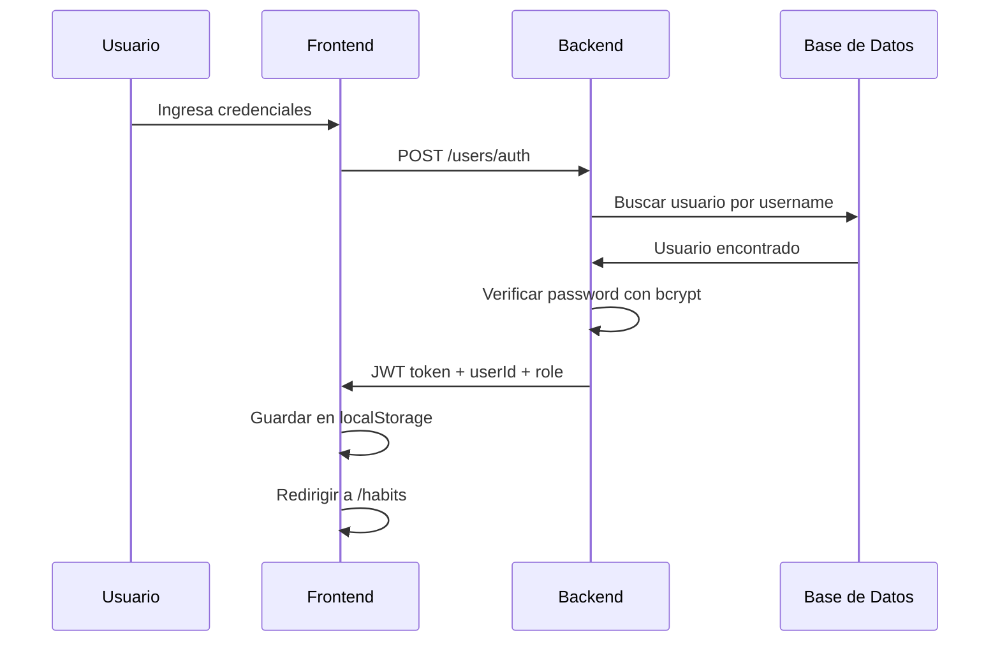
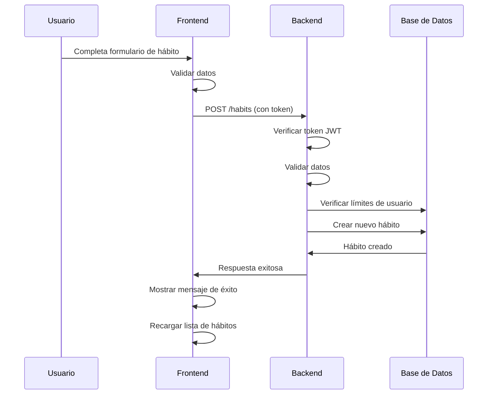
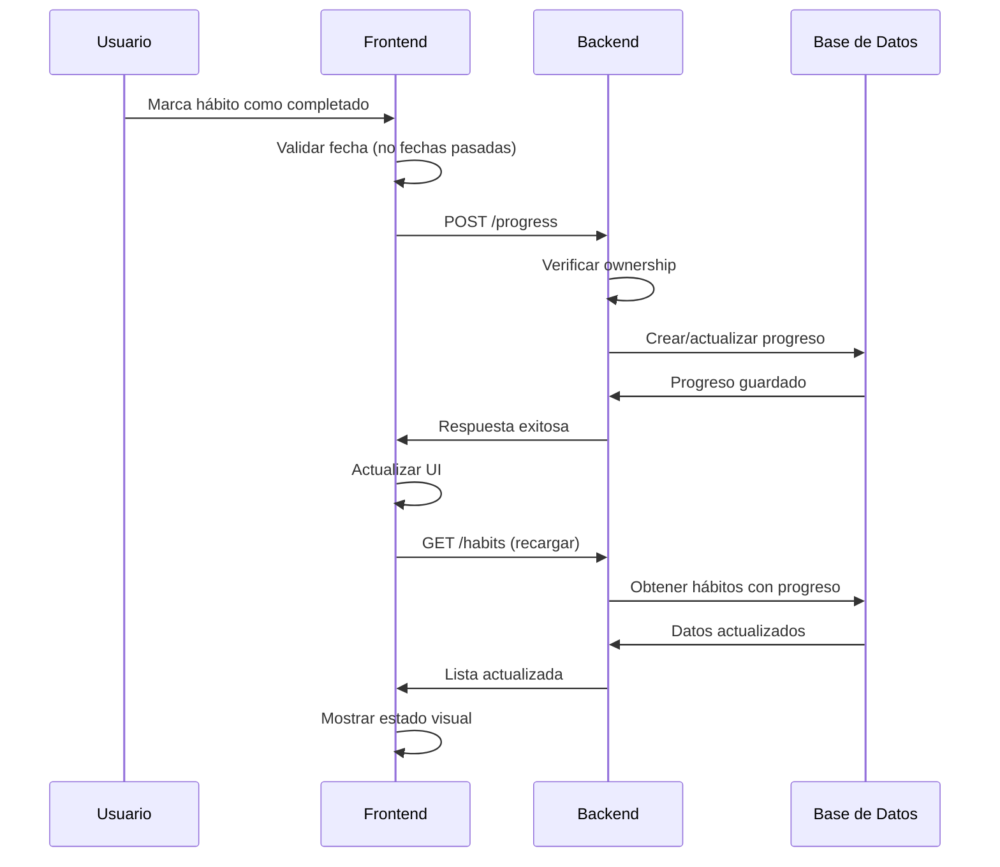

# Abel Habits - Análisis Educativo Completo

## Descripción del Proyecto

**Abel Habits** es una aplicación web completa para la gestión de hábitos personales, desarrollada con tecnologías modernas y siguiendo las mejores prácticas de desarrollo. Este proyecto sirve como ejemplo educativo para estudiantes que quieren aprender desarrollo web full-stack.

### Características Principales

- ✅ **Gestión de Hábitos**: Crear, editar y eliminar hábitos personalizados
- 📊 **Seguimiento de Progreso**: Marcar hábitos como completados o fallidos
- 🎯 **Sistema de Metas**: Establecer objetivos con períodos personalizados
- 📅 **Agenda Personal**: Organizar eventos y actividades diarias
- 📈 **Visualización de Progreso**: Calendario visual con estadísticas
- 🔐 **Autenticación Segura**: Sistema de login/registro con JWT
- 👥 **Roles de Usuario**: Regular y Admin con diferentes permisos

---

## Arquitectura del Proyecto

### Estructura de Directorios

```
abel-habits/
├── 📁 api/          # Backend - API REST con Express
│   ├── 📁 logic/    # Lógica de negocio
│   ├── 📁 routes/   # Definición de endpoints
│   └── 📁 tests/    # Tests automatizados
├── 📁 app/          # Frontend - Aplicación React
│   ├── 📁 src/
│   │   ├── 📁 logic/    # Lógica del cliente
│   │   ├── 📁 view/     # Componentes React
│   │   └── 📁 util/     # Utilidades
│   └── 📁 public/   # Archivos estáticos
├── 📁 dat/          # Base de Datos - Modelos MongoDB
├── 📁 com/          # Común - Validaciones y utilidades
└── 📁 doc/          # Documentación
```

### Patrón Arquitectónico

El proyecto implementa una **arquitectura de tres capas** con patrón **MVC**:

```
┌─────────────────┐    ┌─────────────────┐    ┌─────────────────┐
│   Frontend      │    │   Backend       │    │   Base de       │
│   (React)       │◄──►│   (Express)     │◄──►│   Datos         │
│   - Vista       │    │   - Controlador │    │   (MongoDB)     │
│   - Componentes │    │   - Lógica      │    │   - Modelos     │
└─────────────────┘    └─────────────────┘    └─────────────────┘
```

---

##  Stack Tecnológico

### Frontend
- **React 18** - Biblioteca para interfaces de usuario
- **React Router** - Navegación entre páginas
- **Tailwind CSS** - Framework de estilos utilitarios
- **Vite** - Herramienta de build rápida

### Backend
- **Node.js** - Runtime de JavaScript
- **Express** - Framework web minimalista
- **MongoDB** - Base de datos NoSQL
- **Mongoose** - ODM para MongoDB
- **JWT** - Autenticación basada en tokens
- **bcrypt** - Hashing de contraseñas

### Herramientas de Desarrollo
- **ESLint** - Linter para JavaScript
- **PostCSS** - Procesador de CSS
- **Autoprefixer** - Agregar prefijos CSS automáticamente

---

## Análisis Detallado por Módulo

### Backend (api/)

#### Configuración Principal

```javascript
// api/index.js
const server = express()
server.use(cors())           // Permite peticiones desde el frontend
server.use(express.json())   // Parsea JSON en las peticiones

// Rutas organizadas por recurso
server.use('/users', usersRouter)
server.use('/habits', habitsRouter)
server.use('/goals', goalsRouter)
server.use('/progress', progressRouter)
server.use('/events', eventsRouter)
```

**Conceptos Educativos:**
- **Middleware**: Funciones que se ejecutan entre la petición y la respuesta
- **CORS**: Cross-Origin Resource Sharing - permite comunicación entre dominios
- **Routing**: Organización de endpoints por funcionalidad

#### Sistema de Autenticación

**Middleware de Autorización:**
```javascript
// api/routes/helpers/authorizationHandler.js
export default (req, res, next) => {
    try {
        const token = req.headers.authorization?.slice(7)  // Remueve "Bearer "
        const { sub: userId } = jwt.verify(token, process.env.JWT_SECRET)
        req.user = { id: userId }  // Agrega info del usuario a la petición
        next()
    } catch (error) {
        next(new AuthorizationError(error.message))
    }
}
```

**Lógica de Autenticación:**
```javascript
// api/logic/users/authenticateUser.js
export default (username, password) => {
  validate.username(username);
  validate.password(password);

  return User.findOne({ username })
    .then((user) => {
      if (!user) throw new CredentialsError("credenciales incorrectas");
      
      return bcrypt.compare(password, user.password).then((match) => {
        if (!match) throw new CredentialsError("credenciales incorrectas");
        
        return { id: user._id.toString(), role: user.role };
      });
    });
};
```

**Conceptos Educativos:**
- **JWT (JSON Web Token)**: Token que contiene información del usuario de forma segura
- **Middleware de autorización**: Verifica que el usuario esté autenticado
- **bcrypt**: Librería para comparar contraseñas hasheadas de forma segura
- **Promesas**: Manejo asíncrono de operaciones de base de datos

#### Endpoints de Hábitos

**Rutas:**
```javascript
// api/routes/habits/index.js
habitsRouter.post('/', authorizationHandler, jsonBodyParser, addHabitHandler);
habitsRouter.get('/', authorizationHandler, getHabitsHandler);
habitsRouter.patch('/:habitId', authorizationHandler, jsonBodyParser, updateHabitHandler);
habitsRouter.delete('/:habitId', authorizationHandler, deleteHabitHandler);
```

**Lógica de Crear Hábito:**
```javascript
// api/logic/habits/addHabit.js
export default (userId, name, category, subcategory, emoji) => {
  // Validaciones
  validate.id(userId, "userId");
  validate.name(name);
  validate.text(category);
  validate.emoji(emoji);

  return User.findById(userId)
    .then((user) => {
      if (!user) throw new NotFoundError("usuario no encontrado");

      // Límites de negocio
      return Promise.all([
        Habit.countDocuments({ user: userId }),
        Habit.countDocuments({ user: userId, createdAt: { $gte: today, $lt: tomorrow } })
      ])
        .then(([totalHabits, todayHabits]) => {
          if (totalHabits >= 10) {
            throw new ValidationError("Solo puedes tener hasta 10 hábitos activos por día");
          }
          
          // Crear el hábito
          const habit = new Habit({ name, emoji, category, subcategory, user: userId });
          return habit.save();
        });
    });
};
```

**Conceptos Educativos:**
- **Validaciones de negocio**: Límites como máximo 10 hábitos por usuario
- **Consultas agregadas**: `countDocuments()` para contar registros
- **Filtros de fecha**: `$gte` (mayor o igual) y `$lt` (menor que)
- **Transacciones**: Operaciones que deben ser atómicas

### Frontend (app/)

#### Configuración Principal

```javascript
// app/src/App.jsx
export default function App() {
    return (
        <Context.Provider value={{ alert }}>
            <div className="flex flex-col min-h-screen bg-gradient-to-br from-blue-50 to-indigo-100">
                <main className="flex-grow pb-20">
                    {!isUserLoggedIn() ? (
                        <Routes>
                            <Route path="/" element={<Navigate to="/register" replace />} />
                            <Route path="/register" element={<Register />} />
                            <Route path="/login" element={<Login onLoggedIn={handleGoToHabits} />} />
                        </Routes>
                    ) : (
                        <Routes>
                            <Route path="/" element={<Navigate to="/habits" replace />} />
                            <Route path="/habits" element={<Habits />} />
                            <Route path="/goals" element={<Goals />} />
                            <Route path="/progress" element={<Progress />} />
                            <Route path="/diary" element={<Diary />} />
                            <Route path="/settings" element={<Settings />} />
                        </Routes>
                    )}
                </main>
                {isUserLoggedIn() && <Footer />}
            </div>
        </Context.Provider>
    );
}
```

**Conceptos Educativos:**
- **React Router**: Navegación entre páginas sin recargar
- **Renderizado condicional**: Diferentes rutas según estado de autenticación
- **Context API**: Compartir estado global entre componentes
- **Componentes funcionales**: Uso de hooks modernos de React

#### Componente de Login

```javascript
// app/src/view/Login.jsx
export default function Login(props) {
    const [loading, setLoading] = useState(false);
    const [formData, setFormData] = useState({ username: '', password: '' });
    const [formErrors, setFormErrors] = useState({});

    const handleSubmit = async (event) => {
        event.preventDefault();
        
        if (!validateForm()) return;
        
        setLoading(true);
        try {
            await logic.loginUser(formData.username, formData.password);
            props.onLoggedIn();
        } catch (error) {
            alert(error.message);
        } finally {
            setLoading(false);
        }
    };
}
```

**Conceptos Educativos:**
- **Hooks de estado**: `useState` para manejar estado local
- **Formularios controlados**: Estado sincronizado con inputs
- **Validación en tiempo real**: Errores que se muestran mientras el usuario escribe
- **Estados de carga**: Feedback visual durante operaciones asíncronas
- **Manejo de errores**: Try-catch para capturar y mostrar errores

#### Componente de Hábitos

```javascript
// app/src/view/Habits.jsx
export default function Habits() {
    const [habits, setHabits] = useState([]);
    const [selectedDate, setSelectedDate] = useState(new Date());
    const [loading, setLoading] = useState(true);

    useEffect(() => {
        loadHabits();
    }, [selectedDate]);

    const handleCompleteHabit = async (habitId) => {
        if (isDateInPast(selectedDate)) {
            alert('No puedes marcar progreso en fechas pasadas.');
            return;
        }

        try {
            await logic.addProgress(userId, habitId, selectedDate.toISOString().split('T')[0], 'done');
            await loadHabits(); // Recargar datos
        } catch (error) {
            alert(error.message);
        }
    };
}
```

**Conceptos Educativos:**
- **useEffect**: Hook para efectos secundarios (cargar datos)
- **Dependencias**: El efecto se ejecuta cuando cambia `selectedDate`
- **Validaciones de UI**: No permitir acciones en fechas pasadas
- **Actualización optimista**: Recargar datos después de cambios
- **Manejo de estados**: Loading, error, success

### Base de Datos (dat/)

#### Modelos

```javascript
// dat/models.js
const userSchema = new Schema({
    name: { type: String, required: true, minLength: 2 },
    email: { 
        type: String, 
        required: true, 
        unique: true,
        match: /^[\w-\.]+@([\w-]+\.)+[\w-]{2,4}$/
    },
    username: { type: String, required: true, unique: true, minLength: 3, maxLength: 30 },
    password: { type: String, required: true, minLength: 8 },
    role: { type: String, required: true, enum: ["regular", "admin"], default: "regular" }
});

const habitSchema = new Schema({
    name: { type: String, required: true },
    emoji: { type: String },
    user: { type: ObjectId, ref: "User", required: true },
    category: { 
        type: String, 
        enum: ["salud y bienestar", "actividad física", "desarrollo personal", "negativos", "finanzas", "sociales"],
        required: true 
    },
    createdAt: { type: Date, default: Date.now }
});
```

**Conceptos Educativos:**
- **Esquemas de Mongoose**: Definición de estructura de datos
- **Validaciones**: `required`, `minLength`, `maxLength`
- **Tipos de datos**: String, Date, ObjectId
- **Referencias**: `ref: "User"` para relaciones entre colecciones
- **Enums**: Valores permitidos para un campo
- **Valores por defecto**: `default: Date.now`

#### Relaciones entre Modelos

```
┌─────────────┐    ┌─────────────┐    ┌─────────────┐
│    User     │    │    Habit    │    │  Progress   │
│             │◄───┤             │◄───┤             │
│ (1 usuario) │    │ (N hábitos) │    │ (N progreso)│
└─────────────┘    └─────────────┘    └─────────────┘
       │                   │
       │                   │
       ▼                   ▼
┌─────────────┐    ┌─────────────┐
│    Goal     │    │    Event    │
│             │    │             │
│ (N metas)   │    │ (N eventos) │
└─────────────┘    └─────────────┘
```

**Conceptos Educativos:**
- **Relaciones 1:N**: Un usuario tiene muchos hábitos
- **Referencias**: ObjectId para conectar documentos
- **Normalización**: Evitar duplicación de datos
- **Integridad referencial**: Mantener consistencia entre colecciones

### Lógica de Negocio

#### Validaciones

```javascript
// com/validate.js
const validateUsername = (username) => {
  if (typeof username !== "string")
    throw new ValidationError("nombre de usuario inválido");
  if (username.length < 3 || username.length > 30)
    throw new ValidationError("longitud de nombre de usuario inválida");
};

const validateEmail = (email) => {
  if (typeof email !== "string") throw new ValidationError("email inválido");
  if (!/^[\w-\.]+@([\w-]+\.)+[\w-]{2,4}$/i.test(email))
    throw new ValidationError("email inválido");
};
```

**Conceptos Educativos:**
- **Validación de tipos**: Verificar que los datos sean del tipo correcto
- **Expresiones regulares**: Patrones para validar formatos
- **Errores personalizados**: Mensajes claros para el usuario
- **Reutilización**: Funciones que se usan en frontend y backend

#### Manejo de Errores

```javascript
// com/errors.js
const createCustomError = name =>
    class extends Error {
        constructor(message) {
            super(message)
            this.name = name
        }
        static get name() { return name }
    }

const errors = {
    ValidationError: createCustomError('Error de Validación'),
    NotFoundError: createCustomError('Error de No Encontrado'),
    DuplicityError: createCustomError('Error de Duplicidad'),
    CredentialsError: createCustomError('Error de Credenciales'),
    SystemError: createCustomError('Error del Sistema'),
    AuthorizationError: createCustomError('Error de Autorización')
}
```

**Conceptos Educativos:**
- **Herencia de clases**: Extender la clase Error
- **Factory functions**: Función que crea clases
- **Errores específicos**: Diferentes tipos para diferentes situaciones
- **Consistencia**: Mismos errores en frontend y backend

---

## Flujos de Datos

### Autenticación y Autorización



**Conceptos Educativos:**
- **JWT**: Token que contiene información del usuario
- **localStorage**: Almacenamiento persistente en el navegador
- **bcrypt**: Comparación segura de contraseñas hasheadas
- **Redirección**: Cambio de ruta después de login exitoso

### Creación de Hábito



**Conceptos Educativos:**
- **Validación en capas**: Frontend y backend validan datos
- **Autorización**: Token requerido para operaciones
- **Límites de negocio**: Máximo 10 hábitos por usuario
- **Feedback al usuario**: Mensajes de éxito/error

### Seguimiento de Progreso



**Conceptos Educativos:**
- **Validaciones de negocio**: No permitir fechas pasadas
- **Ownership**: Verificar que el usuario sea dueño del recurso
- **Actualización optimista**: Recargar datos después de cambios
- **Estados visuales**: Diferentes colores según estado del hábito

---

## Configuración y Herramientas

### Configuraciones Clave

**Vite** (`app/vite.config.js`):
```javascript
export default defineConfig({
  plugins: [react()],
  server: {
    proxy: {
      '/api': 'http://localhost:3000'  // Proxy para desarrollo
    }
  }
})
```

**Tailwind** (`app/tailwind.config.js`):
```javascript
export default {
  content: ['./src/**/*.{js,jsx,ts,tsx}'],
  theme: {
    extend: {
      fontFamily: {
        sans: ['Roboto Slab']
      }
    }
  }
}
```

### Testing y Calidad de Código

**Estructura de Tests** (`api/runAllTests.js`):
```javascript
const tests = {
    users: ['registerUser.test.js', 'authenticateUser.test.js'],
    habits: ['addHabit.test.js', 'getHabits.test.js', 'updateHabit.test.js'],
    goals: ['addGoal.test.js', 'getGoals.test.js'],
    events: ['addEvent.test.js', 'getEvents.test.js'],
    progress: ['addProgress.test.js', 'getProgress.test.js']
};
```

**Ejemplo de Test**:
```javascript
// api/logic/users/authenticateUser.test.js
db.connect(process.env.MONGO_URL_TEST)
    .then(async () => {
        await User.deleteOne({ email });
        await registerUser('Test User', email, username, password, password);
        const result = await authenticateUser(username, password);
        console.log('✅ Usuario autenticado exitosamente:', result);
    })
    .finally(() => db.disconnect());
```

---

## Conceptos Técnicos Explicados

### Middleware
```javascript
// Función que se ejecuta entre la petición y la respuesta
const authorizationHandler = (req, res, next) => {
    // Verificar token
    // Agregar info del usuario a req
    next(); // Continuar al siguiente middleware
};
```

### Hooks de React
```javascript
// useState: Manejar estado local
const [habits, setHabits] = useState([]);

// useEffect: Efectos secundarios
useEffect(() => {
    loadHabits();
}, [selectedDate]); // Se ejecuta cuando cambia selectedDate
```

### Promesas y Async/Await
```javascript
// Manejo asíncrono de operaciones
const loadHabits = async () => {
    try {
        const habitsData = await logic.getHabits(selectedDate);
        setHabits(habitsData);
    } catch (error) {
        alert(error.message);
    }
};
```

### Validaciones
```javascript
// Validación de tipos y formatos
const validateEmail = (email) => {
    if (typeof email !== "string") 
        throw new ValidationError("email inválido");
    if (!/^[\w-\.]+@([\w-]+\.)+[\w-]{2,4}$/i.test(email))
        throw new ValidationError("email inválido");
};
```

---

## ✅ Buenas Prácticas Implementadas

### 1. Separación de Responsabilidades
- ✅ Lógica de negocio separada de la presentación
- ✅ Validaciones centralizadas en módulo `com`
- ✅ Rutas organizadas por recurso

### 2. Seguridad
- ✅ Contraseñas hasheadas con bcrypt
- ✅ Autenticación con JWT
- ✅ Validación de ownership en operaciones
- ✅ Sanitización de inputs

### 3. Experiencia de Usuario
- ✅ Validaciones en tiempo real
- ✅ Estados de carga
- ✅ Mensajes de error claros
- ✅ Interfaz responsiva

### 4. Mantenibilidad
- ✅ Código modular y reutilizable
- ✅ Nomenclatura consistente
- ✅ Documentación en README
- ✅ Tests automatizados

---

## Conclusión

Este proyecto demuestra una implementación sólida de una aplicación web moderna con:

- **Arquitectura bien estructurada** con separación clara de responsabilidades
- **Tecnologías modernas** como React, Express, y MongoDB
- **Buenas prácticas** de desarrollo y seguridad
- **Experiencia de usuario** intuitiva y responsiva
- **Código mantenible** y escalable
